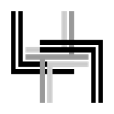

# CFDG LIB


Some utils I use in my CFDG works. If you don't know what I mean check out
awesome [**Context Free Art**](https://www.contextfreeart.org/) program!

My gallery: [ello](https://ello.co/teddydd) (see #cfdg tag)

Source code of many of my works can be found [here](https://gitlab.com/TeddyDD/cfdg-projects)

## Usage

Import using relative path

```
startshape foo []
import "../lib.cfdg"
```

## Contributing

By contributing you agree to release your changes into public domain. (see
LICENSE). You have been warned.
